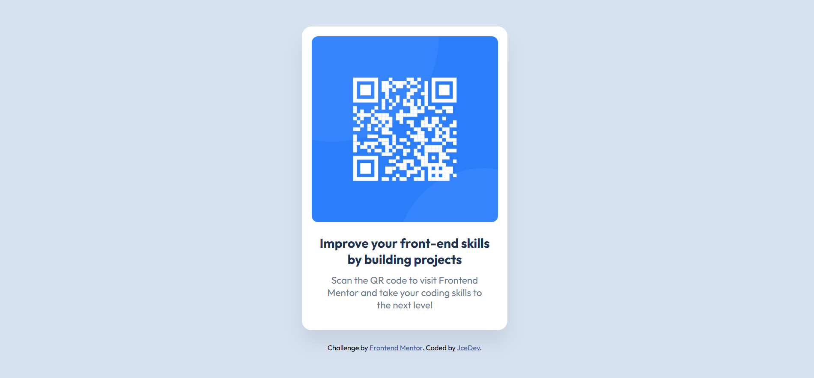

# QR Code Component

This is a solution to the QR code component challenge on Frontend Mentor.

## Screenshot

## Links

- Live Site: https://jcedevqrcode.netlify.app
- Solution: https://github.com/Jaumceb/qr-code-component-main

## Built with

- HTML5
- CSS Flexbox
- Mobile-first workflow

## What I learned

I practiced centering elements with Flexbox and working with CSS variables.
